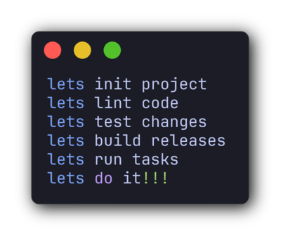

# lets - A Nix Task Runner


> [!WARNING]
> 🚧 This project is under active development 🚧
>
> While it is ready to use in its current form, it is still in an experimental phase.
> Use at your own risk and expect things to break.

A simple task runner that combines the power of Nix and Bash.

## Goals

This project aims for:

* [ ] Reusable tasks across CLI, editor, git hooks and CI
* [ ] Reproducible outcome on any environment
* [ ] Support for task composition
* [ ] Modularity: splitting files into smaller manageable units
* [ ] Automated quality checks
* [ ] Reduce duplication across projects
* [ ] Modern tooling: good linter, formatter and LSP
* [ ] Language/Framework/Tool agnostic. Use the same tool on any project
* [ ] Performant and easy to use

## Requirements

* [Nix](https://nixos.org/download/) with [flakes](https://wiki.nixos.org/wiki/Flakes) enabled (`nix-command` + `flakes`)

## Quickstart (integrate into your flake)

1. Add `lets` as an input.
2. Define tasks in your project (and optionally reuse some presets).
3. Build outputs with `mkOutputs`.
4. Add `mkLets` to your dev shell so `lets <task>` works.

```nix
{
  inputs = {
    nixpkgs.url = "github:nixos/nixpkgs/nixos-unstable";
    lets.url = "github:JeffDess/lets";
  };

  outputs = { nixpkgs, lets, ... }:
    let
      system = "x86_64-linux";
      pkgs = nixpkgs.legacyPackages.${system};

      # Optional: reuse upstream tasks
      baseTasks = lets.lib.${system}.mkTasks { inherit pkgs; };

      # Your project tasks (see auto-discovery for an alternative approach)
      tasks = {
        inherit (baseTasks) lint_bash lint_nix; # Optional
        # Example of inline task
        lint_js = {
          description = "Lint JavaScript";
          app = pkgs.writeShellApplication {
            name = "lint_js";
            runtimeInputs = with pkgs; [ nodejs nodePackages.eslint ];
            text = "eslint .";
          };
        };
      } // import ./tasks.nix { inherit pkgs; }; # Optional, for external task definitions

      taskOutputs = lets.lib.${system}.mkOutputs { inherit pkgs tasks; };
      letsCmd = lets.lib.${system}.mkLets { inherit pkgs; };
    in
    {
      apps.${system} = taskOutputs.apps;
      devShells.${system}.default = pkgs.mkShell { packages = [ letsCmd ]; };
    };
}
```

Then in your project:

```bash
nix develop
lets help
lets lint bash
lets lint nix
lets lint js
```

### Auto-discovery

Instead of including tasks in your flake or wiring each task by hand,
point `mkTasksFromDir` at a directory and every nix file in it becomes a task
automatically.

```nix
tasks = lets.lib.${system}.mkTasksFromDir {
  inherit pkgs;
  dir = ./tasks; # or any directory in your project
  extraTasks = { inherit (baseTasks) lint_bash lint_nix lint; }; # Optional
};
```

It discovers both layouts:

* `<dir>/<name>.nix` — a single file
* `<dir>/<name>/default.nix` — a task directory (for tasks with their own scripts/fixtures)

Directories without a `default.nix` (e.g. a shared `tasks/lib/`) are ignored,
so you can keep helper scripts next to your tasks.
A single file may declare more than one task.

## Base tasks

`mkTasks` ships with a small set of tasks you can reuse directly or compose in your own tasks:

* `help` - Lists available tasks and their descriptions (auto-generated from your task set).
* `lint_bash` - Lints bash fragments embedded in Nix files and all `.sh` files using `shfmt` and `shellcheck`.
* `lint_nix` - Lints Nix files with `statix` and `deadnix`.
* `lint_nix-bash` - Lints just the bash fragments embedded in Nix files.
* `lint` - Runs all lint tasks in this flake (but you probably want to define your own).

## Demo task (from the flake)

The repo includes a [`demo` task](tasks/demo/default.nix) you can run directly from the flake:

```bash
nix run github:JeffDess/lets demo
```

## Defining tasks

Each task is an attribute with:

* `description` (shown in `lets help`)
* `name` (optional) is the built binary, which is the command you run.
  Defaults to the attribute key. You most likely don't need to set that value,
  unless you have a special case for it.
* `runtimeInputs` must include packages you run in your task
* `run` is the actual implementation
* `flags` (optional): the command flags you want to be parsed and passed down to
  `run` as environment variable.
  Read more about this in the [declarative flags section](#declarative-flags).

> [!IMPORTANT]
> Use underscores in task key/names when you want multi-word commands.
> So `lint_nix` will be called with `lets lint nix`
> Dashes stay literal inside each word, so `lint_nix-bash` will be called with `lets lint nix-bash`

Task execution can be:

* defined directly in Nix (`run = '' ... '';`)
* backed by shell scripts (`run = builtins.readFile ./scripts/my-task.sh;`)

Minimal task example:

```nix
{
  lint_js = {
    description = "Lint JavaScript";
    app = pkgs.writeShellApplication {
      name = "lint_js";
      runtimeInputs = with pkgs; [ nodejs nodePackages.eslint ];
      run = builtins.readFile ./scripts/lint_js.sh;
    };
  };
}
```

## Declarative flags

While you could parse flags on your tasks as in any standard bash scripts,
`mkTask` allows to declare a `flags` attrset to automatically parse flags from
commands.

```nix
{ mkTask, ... }:
{
  greet = mkTask {
    description = "Hello world with input";
    flags = [ "name" ]
    run = ''
      echo "Hello $name"
    '';
  };
}
```

```bash
$ lets greet --name Foo
# Hello Foo
```

This is nice for a quick way to parse self explanatory flags, but there's also
another way of doing this if you want to unlock more options.

```nix
{ mkTask, ... }:
{
  greet = mkTask {
    description = "Hello world with input";
    flags = {
      name = {
        description = "Hello world with input and default value"; # optional
        short = "n";                    # optional: also accept -n
        default = [ "$USER" "World" ];  # optional: see below
        required = true;                # optional: error if left empty
        type = "string";                # optional: "string" (default) or "bool"
      };
    };
    run = ''
      echo "Hello $name"
    '';
  };
}
```

Then you'd get:

```bash
$ lets greet --name Foo
# Hello Foo

$ lets greet -n Foo
# Hello Foo

# If $USER is set to Foo
$ lets greet
# Hello Foo

# If $USER is unset
$ lets greet
# Hello World
```

Each flag name becomes a bash variable in `run` (`$name`). Underscores map to
dashes in the long form, so a `dry_run` flag exposes `--dry-run` and the variable
`$dry_run`. A `bool` flag takes no value: its presence sets the variable to
`true` (default `false`).

You might have noticed that, since all flag parameters are optional, the first
form `flags = [ "name" ];` is short for `flags = { name = { }; }`.
An empty `{ }` definition is a plain `--name <value>` flag, so the two styles
can be mixed this way.

With that in mind, we could do something like:

```nix
{ mkTask, ... }:
{
  greet = mkTask {
    description = "Hello world with uppercase option";
    flags = {
      firstname = { default = "World"; };
      lastname = { };
      uppercase = { type = "bool"; };
    };
    run = ''
      msg="Hello $firstname''${lastname:+ $lastname!}"
      if [ "$uppercase" = true ]; then
        msg="''${msg^^}"
      fi
      echo "$msg"
    '';
  };
}

Then you'd get:

```bash
$ lets greet --firstname Foo
# Hello Foo!

$ lets greet --firstname Foo --uppercase
# HELLO FOO!

$ lets greet --firstname Foo --lastname Bar
# Hello Foo Bar!
```

### Resolving a flag's value

A value is resolved as **CLI argument > `default`**. `default` is either a single
value or a list of fallbacks:

* Literal: a plain string or any Nix value like `default = users.foo.name;`
* Environment variable: an element shaped like `"$VAR"` or `"${VAR}"`

Environment references are tried in the order listed, then the literal is the
final fallback, wherever you place it.

```nix
default = [ "$USERNAME" "$USER" "Foo" ];
default = [ "Foo" "$USERNAME" "$USER" ]; # literal position doesn't matter
```

To keep things simple and understandable, stick with the real effective order.

### Flag validation

`mkTask` validates the declaration at evaluation time and fails with a clear
message on a duplicate flag name, a duplicate `short`, a name that is not a bash
identifier, or a `short` that is not a single letter.

## Task composition

A task can run another. Both styles use the injected `tasks` argument — the
fully-resolved set, so you can reach a task from **any** file (this is how you
compose across files, which `rec` can't do):

1) Put the other apps on `PATH` with `runtimeInputs` and call them by name.

```nix
{ tasks, mkTask, ... }:
{
  check = mkTask {
    description = "Run all checks";
    runtimeInputs = with tasks; [ lint_nix.app test.app ];
    run = ''
      lint_nix
      test
    '';
  };
}
```

1) Reference the other app's binary directly via `${tasks.<name>.app}/bin/<name>`.

```nix
{ tasks, mkTask, ... }:
{
  check = mkTask {
    description = "Run all checks";
    run = ''
      ${tasks.lint_nix.app}/bin/lint_nix
      ${tasks.test.app}/bin/test
    '';
  };
}
```

> [!NOTE]
> A task's binary is named after its file — `tasks/lint_nix.nix` builds
> `…/bin/lint_nix` — unless you set `name`, so the calls above just work. When a
> single file declares several tasks they share the file name; there, set `name`
> or resolve the binary with `lib.getExe` (`${lib.getExe tasks.lint_nix.app}`).
> The built-in `lint` (several tasks in one file) composes with `lib.getExe`.

## CI integration

If you wish to run a task in CI, you can just run it from the flake. It will
use the exact same packages as on your local dev shell.

It's important to use `nix run` and not `nix shell` or `nix develop`, as the
latter would install extra packages that aren't needed to run the tasks.

### GitHub Actions

```yaml
env:
  NIX_CONFIG: experimental-features = nix-command flakes

jobs:
  lint:
    runs-on: ubuntu-latest
    steps:
      - uses: actions/checkout@v4
      - uses: DeterminateSystems/nix-installer-action@v21
      - uses: DeterminateSystems/magic-nix-cache-action@v13
      - name: Run lint task
        run: nix run .#lint
```

You can see an example in the [Github CI workflow](.github/workflows/ci.yml) of this project.

### GitLab CI

> [!TIP]
> Use a self-hosted NixOS shell executor for blazingly fast job runs

```yaml
variables:
  NIX_CONFIG: experimental-features = nix-command flakes

lint:
  stage: lint
  script:
    - nix run .#lint

```

You can see a complete file in the [Gitlab CI Pipeline example](.gitlab-ci.yml).

## Task organization strategies

You can organize tasks in several ways.
You can start small and expands as you add more tasks.

Here are some ideas:

### 1) Keep tasks in `flake.nix` (really small projects)

Everything is self-contained in your flake:

```text
.
├── flake.nix
└── scripts/
   └── lint_js.sh
```

### 2) Put all tasks in one `tasks.nix` (simple tasks)

Import an external file containing all of your tasks:

```text
.
├── flake.nix
├── tasks.nix
└── scripts/
   ├── lint_js.sh
   └── test.sh
```

For this pattern, you can include it like:

```nix
tasks = import ./tasks.nix { inherit pkgs; };
```

Or, with base tasks:

```nix
tasks = {
  inherit (baseTasks) lint_bash lint_nix;
} // import ./tasks.nix { inherit pkgs; };
```

### 3) One file per task in `tasks/`

```text
.
├── flake.nix
└── tasks/
   ├── lib/
   │  ├── lint_js.sh
   │  └── test.sh
   ├── lint_js.nix
   ├── test.nix
   └── build.nix
```

Auto-discovered with [`mkTasksFromDir`](#auto-discovery):

```nix
tasks = lets.lib.${system}.mkTasksFromDir {
  inherit pkgs;
  dir = ./tasks;
  extraTasks = { inherit (baseTasks) lint_bash; }; # Optional
};
```

### 4) Use task directories (`tasks/<taskName>/default.nix`)

Useful when each task has its own script, config, or fixtures.
Also auto-discovered with [`mkTasksFromDir`](#auto-discovery).

```text
.
├── flake.nix
├── tasks/
│  ├── lint_js/
│  │  ├── default.nix
│  │  └── lint_js.sh
│  ├── test/
│  │  ├── default.nix
│  │  └── test.sh
│  └── release/
│     ├── default.nix
│     ├── changelog.tpl
│     └── release.sh
└── scripts/
   └── shared-lib.sh
```

With auto-discovery, you could easily mix #3 and #4.
