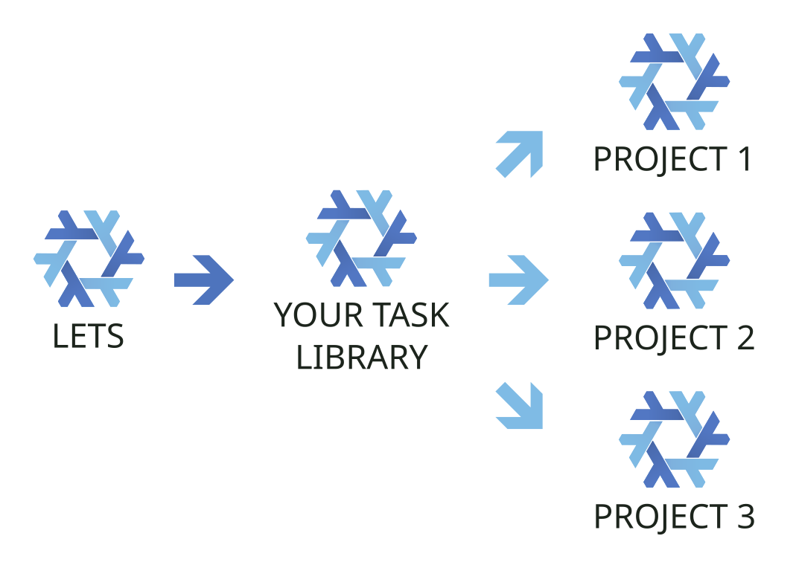

# lets - A Nix Task Runner


> [!WARNING]
> 🚧 This project is under active development 🚧
>
> While it is ready to use in its current form, it is still in an
> experimental phase.
> Use at your own risk and expect things to break.

A simple task runner that combines the power of Nix and Bash.

## Goals

This project aims for:

* [ ] Reusable tasks across CLI, editor, git hooks and CI
* [ ] Reproducible outcome on any environment
* [ ] Support for task composition
* [ ] Modularity: splitting files into smaller manageable units
* [ ] Automated quality checks
* [ ] Reduce duplication across projects
* [ ] Modern tooling: good linter, formatter and LSP
* [ ] Language/Framework/Tool agnostic. Use the same tool on any project
* [ ] Performant and easy to use

## Requirements

* [Nix](https://nixos.org/download/) with
  [flakes](https://wiki.nixos.org/wiki/Flakes) enabled
  (`nix-command` + `flakes`)

## Quickstart

1. Add `lets` as an input.
1. Define a flake variable with `lets.lib.mkFlake` providing:
   * `systems`: list the systems you want to support
   * `tasks`: input your task definitions
   * `nixpkgs`: so tasks resolve the same packages as the rest of your flake
1. Inherit packages and apps from the flake variable
1. Pull the `lets` shell into your devShell via `inputsFrom`

```nix
{
  inputs = {
    nixpkgs.url = "github:nixos/nixpkgs/nixos-unstable";
    lets.url = "github:JeffDess/lets";
  };

  outputs =
    { nixpkgs, lets, ... }:
    let
      pkgs = nixpkgs.legacyPackages.x86_64-linux;
      letsFlake = lets.lib.mkFlake {
        inherit nixpkgs;
        systems = [ "x86_64-linux" ];

        # Your task definitions
        # It can also be a file or a directory path (see "Wiring tasks")
        tasks =
          { mkTask, ... }:
          {
            greet = mkTask {
              description = "Say hello";
              run = ''bold_green "Hello!"'';
            };
          };
      };
    in
    {
      inherit (letsFlake) apps packages;
      devShells.x86_64-linux.default = pkgs.mkShell {
        inputsFrom = [ letsFlake.devShells.x86_64-linux.lets ];
      };
    };
}
```

Then in your project:

```bash
$ nix develop # or `direnv reload`
$ lets greet
# Hello!
```

> [!NOTE]
> Under the hood, `mkFlake` creates :
>
> * An `app` for each of your tasks, so you can `nix run .#my-task`.
> * A dev shell containing the `lets` command, and the `lets` package
>   for every system you list.

### With flake-parts

Already using [flake-parts](https://flake.parts)? Import the module and set
`perSystem.lets.tasks` instead.

```nix
{
  inputs = {
    nixpkgs.url = "github:nixos/nixpkgs/nixos-unstable";
    flake-parts.url = "github:hercules-ci/flake-parts";
    lets.url = "github:JeffDess/lets";
  };

  outputs =
    inputs@{ flake-parts, lets, ... }:
    flake-parts.lib.mkFlake { inherit inputs; } {
      systems = [ "x86_64-linux" ];
      imports = [ lets.flakeModules.default ];
      perSystem =
        { config, pkgs, ... }:
        {
          lets.tasks = ./tasks;
          devShells.default = pkgs.mkShell {
            inputsFrom = [ config.lets.devShell ];
          };
        };
    };
}
```

### Usage

```text
lets <task>                     # Run task
lets -h / --help / help         # Display help and list available tasks
lets -s / --show / show <task>  # Display task details
lets -c / --completions <shell> # Print a shell completion script
lets -v / --version             # Display version
```

### Demo task

The repo also includes a [`demo` task](tasks/demo/default.nix) you can
run directly from the flake:

```bash
nix run github:JeffDess/lets demo
```

## Wiring tasks

The quickstart passed tasks inline. The `tasks` argument accepts four shapes,
so you can pick whatever fits your preferences.

Every shape receives the same scope: `pkgs`, `lib`, `system`, `mkTask`, `tasks`
(for [composition](#task-composition)), [`baseTasks`](#base-tasks) and anything
you add via [`specialArgs`](#extra-inputs).

### A function (inline)

Keep tasks in the flake, as a function of that scope:

```nix
tasks =
  { pkgs, mkTask, ... }:
  {
    greet = mkTask {
      description = "Say hello";
      run = ''bold_green "Hello!"'';
    };
  };
```

### A single file

Move that same function into `tasks.nix` next to your flake:

```text
.
├── flake.nix
└── tasks.nix
```

```nix
tasks = ./tasks.nix;
```

### A directory (auto-discovery)

As your project grows, give each task its own file and point `tasks` at the
directory: every Nix file in it becomes a task:

```nix
tasks = ./tasks;
```

```text
.
├── flake.nix
└── tasks/
   ├── lib/
   ├── test.nix
   └── release/
      ├── default.nix
      ├── changelog.tpl
      └── release.sh
```

It discovers both layouts:

* `<dir>/<name>.nix`: a single file
* `<dir>/<name>/default.nix`: a task directory (for tasks with their own
  scripts/fixtures)

So here `lets test` and `lets release` are wired automatically. Directories
without a `default.nix` (e.g. a shared `tasks/lib/`) are ignored, so you can
keep helper scripts next to your tasks. A single file may declare more than one
task.

## Defining tasks

Tasks have those attributes:

<!-- editorconfig-checker-disable -->
| Attribute | Type | Required | Description |
| --- | --- | --- | --- |
| `description` | string | Yes | Shown in `lets help`. |
| `name` | string | No | The built binary (the command you run). Defaults to the attribute key. You rarely need to set it. |
| `runtimeInputs` | list of packages | No | Packages your task runs at runtime. Optional if no package is used in `run`, required for reproducibility.  |
| `run` | string | Yes | The implementation as an inline string or `builtins.readFile ./my-task.sh` to run an [external script](#external-scripts). |
| `args` | attrset or list | No | CLI arguments (options, flags and positionals) parsed and passed to `run` as variables. See the [declarative arguments section](#declarative-arguments). |
<!-- editorconfig-checker-enable -->

> [!IMPORTANT]
> Use underscores in task key/names when you want multi-word commands.
> So `lint_nix` will be called with `lets lint nix`
> Dashes stay literal inside each word, so `lint_nix-bash` will be
> called with `lets lint nix-bash`

### External scripts

Task execution can be:

* defined directly in Nix (`run = '' ... '';`)
* backed by shell scripts (`run = builtins.readFile ./scripts/my-task.sh;`)

Minimal task example with external script:

```nix
{ mkTask,...}:
{
  greet = mkTask {
    description = "Hello world";
    run = builtins.readFile ./scripts/greet.sh;
  };
}
```

### Extra inputs

Tasks can use packages from any sources. `runtimeInputs` takes real derivations,
so you can mix `pkgs`, sibling [`tasks`](#task-composition), a flake input,
or a second nixpkgs (e.g. stable alongside unstable) in one list.

Pass those extra sources once, in `specialArgs`, they are merged into
every task's scope:

> [!NOTE]
> With the flake-parts module, set `perSystem.lets.specialArgs` instead.

```nix
# flake.nix
lets.lib.mkFlake {
  inherit nixpkgs;
  systems = [ "x86_64-linux" ];
  tasks = ./tasks;
  specialArgs = { inherit inputs; };
};
```

```nix
# tasks/greet.nix
{ pkgs, system, inputs, mkTask, tasks, ... }:
let
  stable = inputs.nixpkgs-stable.legacyPackages.${system};
  foo = inputs.foo.packages.${system}.foo;
in
{
  greet = mkTask {
    description = "Hello World with multiple input sources";
    runtimeInputs = with pkgs; [
      hello         # from pkgs
      stable.baz    # from alternative pkgs
      foo           # from your flake inputs
      tasks.bar.app # from your own tasks
    ];
    run = ''# Your script here'';
  };
}
```

## Text formatting

Every task's `run` gets a small ANSI formatting toolkit injected automatically.
It comes in four flavors:

```bash
# Constants (uppercase):
echo "${BOLD}Hello${RESET} ${BLUE}World${RESET}!"

# Functions (lowercase):
green "✅ done"
bold "Important"

# Merged style + color (<style>_<color>):
bold_blue "Heading"
underline_red "Error"

# Log helpers:
info "listening on :8080"
warn "low disk space"
error "build failed"
```

Available names:

| Kind | Names |
| --- | --- |
| Colors | `black` `red` `green` `yellow` `blue` `magenta` `cyan` `white` |
| Styles | `bold` `dim` `italic` `underline` |

* **Functions** (lowercase) exist for every color and style. They print the text
  formatted, followed by a newline (like `echo`), and
  **already append the reset**, so `blue "hi"` closes itself and there is
  no `reset` function to call.
* **Merged functions** combine any style with any color as `<style>_<color>`
  (e.g. `bold_green`, `dim_cyan`, `underline_yellow`).
* **Log helpers** print a `LEVEL: message` line, with the level word colored
  by severity (see [Logging](#logging) below).
* **Constants** (uppercase: `RED`, `BOLD`, …) exist for the same names. Use them
  when you assemble strings yourself, then you must close the sequence with the
  `RESET` constant: `echo "${BLUE}hi${RESET}"`. `RESET` exists only as
  a constant, for this manual form.

### Color detection

Formatting is emitted only when it makes sense, following the common
conventions:

* **disabled** when stdout is not a terminal (piped or redirected), so logs and
  captured output stay clean;
* **disabled** when `NO_COLOR` is set to a non-empty
  value (takes precedence);
* **forced on** when `FORCE_COLOR` is set (handy to keep colors through a pipe
  or in tests).

When formatting is off, both the constants and the functions degrade gracefully:
constants become empty strings and functions print plain text.

### Logging

Log helpers print `LEVEL: message`, with the level word colored by severity.
They build on the color functions, so they write to **stdout** and follow the
same color detection: `info "x" | cat` degrades to plain `INFO: x`.

```bash
error "build failed"
warn  "deprecated flag"
info  "listening on :8080"
debug "cache hit"
trace "entering handler"
```

| Helper | Level | Color |
| --- | --- | --- |
| `error` | `ERROR` | red |
| `warn` | `WARN` | yellow |
| `info` | `INFO` | green |
| `debug` | `DEBUG` | blue |
| `trace` | `TRACE` | cyan |

Each prints the uppercased level followed by `:` and your message, e.g.
`info "ready"` → `INFO: ready`.

> [!IMPORTANT]
> These names are **reserved** in every task's `run`: the constants, the color
> and style functions, and the log helper functions listed above.
> Avoid redefining them in your scripts.

Here's a minimal example:

```nix
{ mkTask, ... }:
{
  greet = mkTask {
    description = "Hello world in color";
    run = ''
      bold_blue "Hello, World!"
    '';
  };
}
```

Full example: [`greet-color`](examples/greet-color/task.nix)

```bash
$ lets greet
# Hello, World! (bold blue on a terminal)

$ lets greet | cat
# Hello, World!  (plain text when piped)
```

## Declarative arguments

While you could parse arguments in your tasks as in any standard bash script,
`mkTask` lets you declare an `args` attrset to automatically parse them from the
command line. Each argument name becomes a bash variable in `run`.

> [!NOTE]
> A _declarative argument_ is one of:
>
> * an _option_, which takes a value (`--name Foo`)
> * a _flag_, which is a boolean toggle (`--dry-run`)
> * a _positional_, bound by its position on the received command
>
> The `type` attribute picks which one you get (`option` by default).

### Simple arguments

Adding only the long form of self explanatory options is really simple.
By default, arguments are long form options:

```nix
{ mkTask, ... }:
{
  greet = mkTask {
    description = "Hello world with input";
    args = [ "firstname" "lastname" ];
    run = ''
      echo "Hello $firstname $lastname"
    '';
  };
}
```

Full example: [`greet-args`](examples/greet-args/task.nix)

```bash
$ lets greet --firstname Foo --lastname Bar
# Hello Foo Bar
```

Order does not matter, but argument names must match exactly.

### Parametrized arguments

There's also another way of doing this if you want to unlock more options:

```nix
{ mkTask, ... }:
{
  greet = mkTask {
    description = "Hello world with input";
    args = {
      name = {
        # Added to `lets help`
        description = "Hello world with input and default value";
        # Accept -n as an alias to --name
        short = "n";
        # See Default section below
        default = [ "$USER" "World" ];
        # Error if --name or -n is not provided
        required = true;
        # "option" (default), "flag" or "positional"
        type = "option";
      };
    };
    run = ''
      echo "Hello $name"
    '';
  };
}
```

Full example: [`greet-parametrized`](examples/greet-parametrized/task.nix)

Then you'd get:

```bash
$ lets greet --name Foo
# Hello Foo

$ lets greet -n Foo
# Hello Foo

# If $USER is set to Foo
$ lets greet
# Hello Foo

# If $USER is unset
$ lets greet
# Hello World
```

> [!IMPORTANT]
> Underscores map to dashes in the long form, so a `dry_run` argument exposes
> `--dry-run` and the variable `$dry_run`.

#### Short form

You can add a shorthand for passing your argument, like `-n` for `--name` in
the example. `mkTask` validates the declaration at evaluation time and fails
with a clear message on a duplicate argument name, a duplicate `short`, a name
that is not a bash identifier, or a `short` that is not a single letter.

#### Inline value

An option's value can be passed as a separate word (`--name Foo`) or attached to
the long form with an `=` (the _inline value_ form):

```bash
$ lets greet --name=Foo
# Hello Foo
```

Short forms always take their value as the next word (`-n Foo`).

#### Default

A value is resolved as CLI argument first, then fallbacks to `default` value if
argument wasn't passed.
`default` is either a single value or a list of fallbacks.

* Literal: a plain string or any Nix value like `default = users.foo.name;`
* Environment variable: an element shaped like `"$VAR"` or `"${VAR}"`

Environment references are tried in the order listed, then the literal is the
final fallback, wherever you place it.

```nix
default = [ "$USERNAME" "$USER" "Foo" ];
default = [ "Foo" "$USERNAME" "$USER" ]; # literal position doesn't matter
```

To keep things understandable, stick with the real effective order.

#### Flags

A `flag` (`type = "flag"`) takes no value: its presence sets the variable to
`true` (default `false`).

#### Positional arguments

A `positional` is bound by its place on the command line rather than by a
`--name`, using a 1-based `index` (index 0 is the command itself). It supports
`default` and `required` like an option, but not `short`, and indices must be
contiguous starting at 1.

```nix
{ mkTask, ... }:
{
  greet = mkTask {
    description = "Hello world with positional arguments";
    args = {
      name = { type = "positional"; index = 1; required = true; };
    };
    run = ''
      echo "Hello $name (the rest stays in \$@: $*)"
    '';
  };
}
```

Full example: [`greet-positional`](examples/greet-positional/task.nix)

Options and flags are parsed first, then the leftover words fill the positionals
in index order. Anything past the declared positionals stays in `$@`:

```bash
$ lets greet Foo Bar
# Hello Foo (the rest stays in $@: Bar)

$ lets greet -- Foo Bar # This is safer, no possible collision with sub-commands
# Hello Foo (the rest stays in $@: Bar)
```

> [!NOTE]
> `lets` finds where the (sub-)command name ends by matching the longest run of
> leading words against your task names, so `lets fmt flake.nix` runs the `fmt`
> task with `flake.nix` as a positional. Use `--` to force a word to be an
> argument (`lets fmt -- nix`, even if a `fmt_nix` task exists). Options must
> come before positionals.

#### Putting it together

You might have noticed that, since all argument parameters are optional, the
first form `args = [ "name" ];` is short for `args = { name = { }; }`.
An empty `{ }` definition is a plain `--name <value>` option, so the two styles
can be mixed this way.

With that in mind, we could do something like:

```nix
{ mkTask, ... }:
{
  greet = mkTask {
    description = "Hello world with uppercase option";
    args = {
      firstname = { default = "World"; };
      lastname = { }; # same as `lastname = { type = "option"; };`
      uppercase = { type = "flag"; };
    };
    run = ''
      msg="Hello $firstname''${lastname:+ $lastname}!"
      if [ "$uppercase" = true ]; then
        msg="''${msg^^}"
      fi
      echo "$msg"
    '';
  };
}
```

Full example: [`greet-together`](examples/greet-together/task.nix)

Result:

```bash
$ lets greet
# Hello World!

$ lets greet --firstname Foo
# Hello Foo!

$ lets greet --firstname Foo --uppercase
# HELLO FOO!

$ lets greet --firstname Foo --lastname Bar
# Hello Foo Bar!
```

## Task composition

A task can run another. Reach the other task through the injected `tasks`
argument, the fully-resolved set, so you can compose across **any** file.
You might use other Nix features to achieve this, but this supported form
works everywhere:

```nix
{ tasks, mkTask, ... }:
{
  check = mkTask {
    description = "Run all checks";
    runtimeInputs = with tasks; [ lint_nix.app test.app ];
    run = ''
      lint_nix
      test
    '';
  };
}
```

> [!NOTE]
> A task's binary is named after the **attribute key** it is bound under (e.g.
> `lint_nix = mkTask { … }` builds `.../bin/lint_nix`), even when one file
> declares several tasks. Set `name` only when you want the command to differ
> from the key.

## Base tasks

`lets` ships with a small set of tasks you can reuse directly or compose in your
own tasks. They are available as `baseTasks` in every task's scope:

* `help` - Lists available tasks and their descriptions
  (auto-generated from your task set). Pass `-t <task>` (or
  `--task <task>`) to print just that task's usage, e.g.
  `lets help -t lint_nix`. `lets --help` and `lets -h` are
  aliases for `lets help`.
* `show <task>` - Prints a single task's usage, the packages it pulls in
  (its `runtimeInputs`) and its script with syntax highlighting, e.g.
  `lets show lint_nix`. `lets --show <task>` and `lets -s <task>` are
  aliases for `lets show <task>`.
* `lint_bash` - Lints bash fragments embedded in Nix files and all `.sh` files
  using `shfmt` and `shellcheck`.
* `lint_nix` - Lints Nix files with `statix` and `deadnix`.
* `lint_nix-bash` - Lints just the bash fragments embedded in Nix files.
* `lint` - Runs all lint tasks in this flake
  (but you probably want to define your own).
* `version [level]` - Bumps the flake's `version`, refreshes `CHANGELOG.md`,
  commits and tags `vX.Y.Z`. `[level]` is one of `major`, `minor`, `patch`,
  `prerel` or `release` (via `semver-tool`); omit it to auto-detect the bump
  from the conventional commits since the last tag (via `git-cliff`). Pass
  `--dry-run` to preview. Expects a `version = "X.Y.Z";` line.
* `release` - Publishes a GitHub release for the current tag, with notes
  generated by `git-cliff`. Fails if the tag does not match the flake
  `version`. Pass `--dry-run` to print the notes without publishing.

The `help` and `show` commands are included by default, but others are
completely optional. Just cherry-pick the presets you need in `baseTasks`
alongside your own:

```nix
# flake.nix
lets.lib.mkFlake {
  inherit nixpkgs;
  systems = [ "x86_64-linux" ];
  tasks =
    { mkTask, baseTasks, ... }:
    { inherit (baseTasks) lint_nix version release; } # Only what you need
    // {
      greet = mkTask {
        description = "Say hello";
        run = ''bold_green "Hello!"'';
      };
    };
};
```

Alternatively, with a single `tasks.nix` file, the same `tasks` content goes
right into the file.

With the directory form, add a small file (e.g. `tasks/presets.nix`) that pulls
in the presets you want:

```nix
# tasks/base.nix
{ baseTasks, ... }: { inherit (baseTasks) lint_nix version release; }
```

## Sharing tasks across projects

Tasks compose across files, but they also compose across **flakes**! A shared
"task library" flake can sit between `lets` and your projects, so several
projects run your favorite tasks with no copy-paste or out-of-sync scripts.



A task module is just a function, when a project pulls it in, the tasks are
rebuilt with the project's own `pkgs` and `mkTask`, so the library's `nixpkgs`
never leaks downstream. Each task keeps its exact, reproducible toolchain, no
matter the project it runs in.

### The task module

A library exposes its tasks as a plain function of the scope, the very
shape the [`tasks` argument](#wiring-tasks) already accepts:

```nix
# library: lets-tasks.nix
{ mkTask, ... }:
{
  deploy = mkTask {
    description = "Deploy the app";
    run = ''echo "deploying"'';
  };
  migrate = mkTask {
    description = "Run database migrations";
    run = ''echo "migrating"'';
  };
}
```

### Publishing the library flake

The library wires those tasks for itself with `mkFlake` (so it is runnable
on its own with `lets deploy`), then re-exports the module as an extra output
so projects can reach it:

```nix
# library: flake.nix
outputs =
  { nixpkgs, lets, ... }:
  let
    letsTasks = import ./lets-tasks.nix;
  in
  lets.lib.mkFlake {
    inherit nixpkgs;
    systems = [ "x86_64-linux" ];
    tasks = letsTasks;
  }
  // {
    inherit letsTasks;
  };
```

### Consuming it

A project adds the library as an input (here `tasklib`) and merges its
module into the project's own `tasks` function. Local keys win on conflict:

```nix
# project: flake.nix
tasks =
  scope:
  (tasklib.letsTasks scope)
  // {
    build = scope.mkTask {
      description = "Build the project";
      run = ''echo "building"'';
    };
  };
```

Now `lets deploy`, `lets migrate` and `lets build` all run in the project,
show up in `lets help`, and get shell completions with no duplication.
They also compose through the [`tasks` fixpoint](#task-composition), across
the library/project boundary.

Again, because the project consumes only the `letsTasks` function
(not `tasklib`'s built outputs), the library's own `nixpkgs` builds nothing
downstream. Point it at yours so the lock file stays tidy:

```nix
# project: flake.nix
inputs.tasklib.inputs.nixpkgs.follows = "nixpkgs";
```

### Cherry-picking

Pull in only the tasks you want, the same way you cherry-pick
[base tasks](#base-tasks):

```nix
# project: flake.nix
tasks =
  scope:
  { inherit (tasklib.letsTasks scope) deploy; }
  // {
    build = scope.mkTask { /* ... */ };
  };
```

### Pinned binaries (variant)

The module above is rebuilt in each project, which is usually what you
want. If instead every project must run the exact same binaries, the
library can pre-build with `lets.lib.loadTasks` and export that per system:

```nix
# library: flake.nix (per-system output)
letsTasks = lets.lib.loadTasks {
  pkgs = nixpkgs.legacyPackages.${system};
  src = ./lets-tasks.nix;
};
```

Projects then merge `tasklib.letsTasks.${system}` directly.
The trade-off is that those tasks are frozen to the library's `nixpkgs`,
so a project on a different `nixpkgs` gets a mixed closure.

## Shell completions

Completions cover the `lets` flags and options, every task (including nested
ones), each task's options and flags, and the task name expected by `show` and
`help --task`. Supported shells are: `bash`, `zsh`, `fish` and `nushell`.

### Install

The `completions` package is project-agnostic, it drops the functions on the
standard search paths (`share/zsh/site-functions`, …), so bash/zsh/fish load
them automatically.

#### NixOS / home-manager

Add `lets` as an input to your config flake (i.e. system, not project flake):

```nix
inputs.lets.url = "github:JeffDess/lets";
```

Then install the `completions` package. With NixOS:

```nix
{ inputs, pkgs, ... }:
{
  programs.zsh.enable = true;
  environment.systemPackages = [
    inputs.lets.packages.${pkgs.system}.completions
  ];
}
```

Alternatively, with home-manager:

```nix
{ inputs, pkgs, ... }:
{
  programs.zsh.enable = true;
  home.packages = [ inputs.lets.packages.${pkgs.system}.completions ];
}
```

And for nushell:

```nix
{ inputs, pkgs, ... }:
let
  completions = inputs.lets.packages.${pkgs.system}.completions;
in
{
  programs.nushell.extraConfig = ''
    source ${completions}/share/lets/completions/lets.nu
  '';
}
```

#### Nix Profile

If you don't want to use a declarative config:

`nix profile install github:JeffDess/lets#completions`.

> [!TIP]
> You can test without installing anything, for instance with zsh, just run:
> `source <(lets -c zsh)`
> Completion will be added to your current shell only

#### Without the package

Save the function into the directory your shell autoloads completions from:

```bash
# bash-completion autoloads this directory
lets -c bash > ~/.local/share/bash-completion/completions/lets
```

```zsh
# any directory on your $fpath works
lets -c zsh > ~/.config/zsh/completions/_lets
```

```fish
lets -c fish > ~/.config/fish/completions/lets.fish
```

```nu
# nushell has no autoload directory: save it, then source from config.nu
lets -c nushell | save -f ~/.config/nushell/lets.nu
source ~/.config/nushell/lets.nu
```

Your completion file doesn't need to be regenerated when your tasks change.

## Editor Support

Since this project is largely built with Nix and Bash, most editors will support
those filetypes out of the box.

An exception to that is the `run` task attribute, which embeds Bash syntax
inside a Nix file. Editors backed by the tree-sitter grammar only inject
Bash highlighting (and LSP features, through tools like
[otter.nvim](https://github.com/jmbuhr/otter.nvim)) for a fixed set of attribute
names. `run` is not one of them, so it stays unhighlighted by default.

In Neovim, add an injection query so tree-sitter treats `run` as Bash. Create
`~/.config/nvim/after/queries/nix/injections.scm`:

```scheme
;extends

; lets: inject Bash into the task `run` attribute
(binding
  attrpath: (attrpath (identifier) @_path)
  expression: [
    (string_expression
      ((string_fragment) @injection.content
        (#set! injection.language "bash")))
    (indented_string_expression
      ((string_fragment) @injection.content
        (#set! injection.language "bash")))
  ]
  (#eq? @_path "run")
  (#set! injection.combined))
```

The `;extends` directive keeps the grammar's built-in injections and only adds
the `run` attribute on top. For a one-off string without any setup, prefix it
with a language hint instead: `run = /* bash */ ''…'';`.

## CI integration

If you wish to run a task in CI, you can just run it from the flake. It will
use the exact same packages as on your local dev shell.

It's important to use `nix run` and not `nix shell` or `nix develop`, as the
latter would install extra packages that aren't needed to run the tasks.

### GitHub Actions

```yaml
env:
  NIX_CONFIG: experimental-features = nix-command flakes

jobs:
  lint:
    runs-on: ubuntu-latest
    steps:
      - uses: actions/checkout@v4
      - uses: DeterminateSystems/nix-installer-action@v21
      - uses: DeterminateSystems/magic-nix-cache-action@v13
      - name: Run lint task
        run: nix run .#lint
```

Refer to this project's [Github CI workflow](.github/workflows/ci.yml)
as an example.

### GitLab CI

> [!TIP]
> Use a self-hosted NixOS shell executor for blazingly fast job runs

```yaml
variables:
  NIX_CONFIG: experimental-features = nix-command flakes

lint:
  stage: lint
  script:
    - nix run .#lint

```

You can see a complete file in the [Gitlab CI Pipeline example](.gitlab-ci.yml).

## Releasing

Releases are cut from conventional commits with
[`semver-tool`](https://github.com/fsaintjacques/semver-tool) and
[`git-cliff`](https://git-cliff.org), driven by two [base tasks](#base-tasks)
and a tag-triggered workflow.

1. Bump the version locally:

   ```bash
   lets version         # auto-detect bump from conventional commits
   lets version minor   # or force: major | minor | patch | prerel | release
   ```

   This rewrites `version` in `flake.nix`, regenerates `CHANGELOG.md`,
   commits `chore(release): vX.Y.Z` and creates the matching tag. Add
   `--dry-run` to preview without writing anything.

2. Review, then push the commit and tag:

   ```bash
   git push --follow-tags
   ```

3. Pushing a `v*` tag triggers
   [`release.yml`](.github/workflows/release.yml). It runs `nix run .#release`
   to publish a GitHub release with the tag's changelog notes. The task fails
   if the tag does not match the flake `version`.

The changelog format lives in [`cliff.toml`](cliff.toml).
